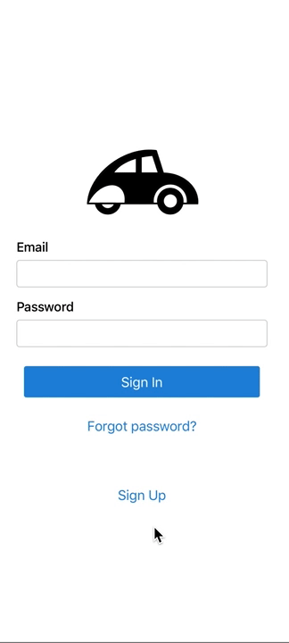

# react-native-expo-auth

React Native Expo Component that provides Sign In, Sign Up, Reset Password flows for user authentication. The component includes an API for FaceID and TouchID (iOS) and Fingerprint API (Android) to authenticate the user with a face or fingerprint scan.



### Installation

`$ npm install --save react-native-expo-auth`

or 

`$ yarn add react-native-expo-auth`


### Usage

```javascript
// ...


import React, { useState } from "react";
import { Authenticate } from "react-native-expo-auth";

const ExampleApp = props => {

    const [isVisible, setIsVisible] = useState(true);
    const [logins, setLogins] = useState(["test@gmail.com"]);

    /**
     * Each callback should return object that contains success and/or error.
     * @param {Object} data
     * @returns {{ success: Boolean, error: String }}
     */
    const submitAuth = async(data, route) => {
        const signUpRaw = await fetch(`http://test.com/${route}`, {
            method: "POST", 
            body: JSON.stringify(data)
        });
        if(signUpRaw.status !== 200) {
            return {
                success: false,
                error: await signUpRaw.text()
            };
        }
        const { emails } = await signUpRaw.json();
        setLogins(emails);
        return {
            success: true
        };
    };

    const submitSignIn = async (data) => await submitAuth(data, "signin");
    const submitSignUp = async (data) => await submitAuth(data, "signup");
    const submitBioLogin = async (data) => await submitAuth(data, "biologin");
    const submitPinCodeRequest = async (data) => await submitAuth(data, "reset");
    const submitNewPassword = async (data) => await submitAuth(data, "doreset");

    render() {
        return (
            <Authenticate
                visible={isVisible}
                onLogin={submitSignIn} 
                onSignUp={submitSignUp}
                onBioLogin={submitBioLogin}
                logins={logins}
                onPinCodeRequest={submitPinCodeRequest}
                onSubmitNewPassword={submitNewPassword}
                enableBio={true}
            >
                <Text>YOUR LOGO</Text>
                <Image
                    source={require("./images/logo.png")}
                />
            </Authenticate>
        );
    }

};

// ...
```

### Props
| Prop | Type | Description |
| :------------ |:---------------:| :-----|
| visible | boolean | Set to `true` to show the component. By default visible is set to true. |
| onLogin | function | Callback will be called once user submits login form.
| onSignUp | function | Callback will be called once user submits submit form. |
| onBioLogin| function | Callback will be called once user uses Mobile Biometric Check( faceId, fingerprint or Pin Code). |
| logins| array | An array of logins which a user is allowed to use during bioLogin. Logins get populated when a user signs in/up using a specific device. |
| onPinCodeRequest| function | Callback that will be called if a user submits forgot password form. |
| onSubmitNewPassword | function | Callback will be called once a user submits a new password after resetting the old one. |
| enableBio | boolean | Enables/Disables Mobile Biometric Check. |


## Contribute
Feel free to open issues or do a PR!